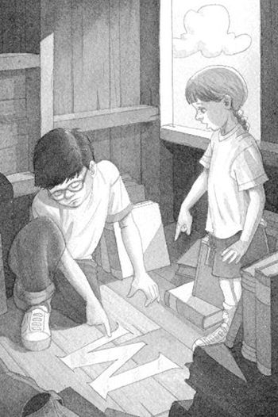
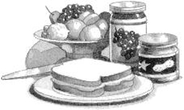

## Chapter 10 — Another Clue

Late-morning sunlight shone through the tree house window. Shadows danced on the walls and ceiling.

Jack took a deep breath. He was lying on the floor of the tree house.

“I wonder what Mom’s making for lunch,” said Annie. She was looking out the window.

Jack smiled. Lunch. Mom. Home. It all sounded so real. So calm and safe.

“I hope it’s peanut butter and jelly sandwiches,” he said.

He closed his eyes. The wood floor felt cool.

“Boy, this place is a mess,” said Annie. “We’d better make it neater. In case M comes back.”

Jack had almost forgotten about M.

Would they ever meet the mysterious M? The person who seemed to own all the books in the tree house?

“Let’s put the Egypt book on the bottom of the pile,” said Annie.

“Good idea,” said Jack. He needed a rest before he visited any more ancient tombs.

“Let’s put the dinosaur book on top of the Egypt book,” said Annie.

“Yeah, good,” said Jack. And a *long* rest before he visited another Tyrannosaurus rex.

“The castle book can go on the very top of the pile,” said Annie.

Jack nodded and smiled. He liked thinking about the knight on the cover of the castle book. He felt as if the knight were his friend.

“Jack,” said Annie. “Look!”

Jack opened his eyes. She was pointing at the wooden floor.

“What is it?” he asked.

“You have to see for yourself.”

Jack groaned as he got up. He stood next to Annie and looked at the floor. He didn’t see anything.

“Turn your head a little,” said Annie. “You have to catch the light just right.”

Jack tipped his head to one side. Something was shining on the floor.

He tipped his head a bit more. A letter came into focus.

The letter M! It shimmered in the sunlight.

This proved the tree house belonged to M.

Absolutely for sure. No question. No doubt about it.

Jack touched the M with his finger. His skin tingled.

Just then the leaves trembled. The wind picked up.

“Let’s go down now,” he said.

Jack grabbed his backpack. Then he and Annie climbed down the ladder.

As they stood on the ground below the tree house, Jack heard a sound in the bushes.

“Who’s there?” he called.

The woods grew still.

“I’m going to bring the medallion back soon,” Jack said loudly. “And the bookmark, too. Both of them. Tomorrow!”

“Who are you talking to?” asked Annie.

“I feel like M is nearby,” Jack whispered.

Annie’s eyes grew wide. “Should we look for him?”

But just then their mother’s voice came from the distance. “Ja-ack! An-nie!”

Jack and Annie looked around at the trees. Then they looked at each other.

“Tomorrow,” they said together.

And they took off, running out of the woods.

They ran down their street.

They ran across their yard.

They ran into their house.

They ran into their kitchen.

They ran right into their mom.

She was making peanut butter and jelly sandwiches.

